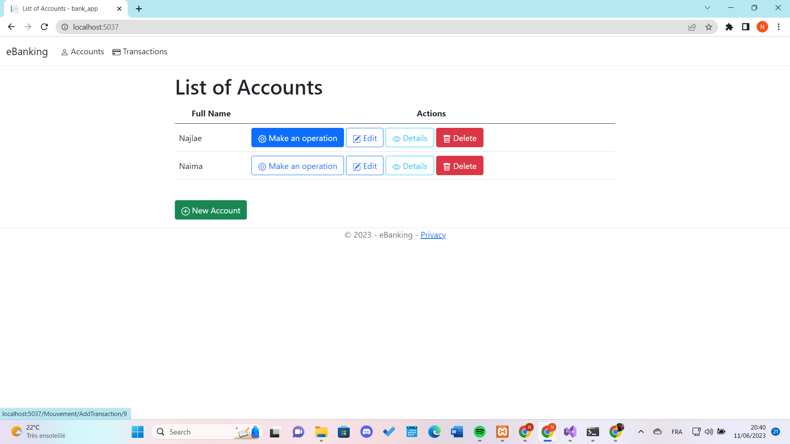

# eBanking

The Bank Management Application is a web-based application built with ASP.NET Core MVC, designed to manage bank accounts and transactions. It utilizes the MySQL database to store the account and transaction data.

## Table of Contents

- [Installation](#installation)
- [Usage](#usage)
- [Database Configuration](#database-configuration)
- [Contributing](#contributing)

## Installation

1. Clone the repository: `git clone (https://github.com/najlae01/bank-app.git)`
2. Open the project in your preferred development environment (e.g., Visual Studio)
3. Build the solution to restore NuGet packages and compile the project

## Usage

1. Configure the database connection string in the `appsettings.json` file
2. Run the project (e.g., press F5 in Visual Studio) to start the application
3. Open your web browser and visit: `http://localhost:[port]` (replace `[port]` with the appropriate port number)

## Database Configuration

1. Install XAMPP: Download and install XAMPP from the [official website](https://www.apachefriends.org/index.html).
2. Start the XAMPP Control Panel: Launch the XAMPP Control Panel to start the Apache and MySQL services.
3. Access phpMyAdmin: Open your web browser and visit `http://localhost/phpmyadmin`.
4. Create a new database: Click on "Databases" tab in phpMyAdmin, enter a name for your database, and click "Create" to create a new database for the application.
5. Update the connection string: Open the appsettings.json file in your project and modify the database connection string with the following details:

```json
"ConnectionStrings": {
  "MyConn": "Server=localhost;Port=3306;Database=[database name];Uid=root;Pwd=[password];"
}
```
Replace `[database name]` with the name of the database you created in step 4, and `[password]` with the password you set for your MySQL root user.

6. Save the changes: Save the `appsettings.json` file.

7. Run the database migrations to create the necessary tables by executing the following command in the Package Manager Console:

```
Update-Database
```

## Contributing

Contributions are welcome! If you want to contribute to this Bank Management Application, follow these steps:

1. Fork the repository
2. Create a new branch: `git checkout -b feature/your-feature`
3. Make your changes and commit them: `git commit -m 'Add some feature'`
4. Push to the branch: `git push origin feature/your-feature`
5. Submit a pull request

You can also open an issue in the GitHub repository.

---

## Database Design

 
 
---

## App Interface

Those screenshots show the web app functionamities that include adding an account, deleting an  account, updating the account holder's name, as well as making transactions such as deposit and withdrawal and deleting them if needed.

  
 <br/>
 <br/>
 
 <br/>
 <br/>
 
 <br/>
 <br/>
 
 <br/>
 <br/>
 
 <br/>
 <br/>
 
 <br/>
 <br/>
 
 <br/>
 <br/>
 
 <br/>
 <br/>
 
 <br/>
 <br/>
 
 <br/>
 <br/>
 
 <br/>
 <br/>
 
 <br/>
 <br/>
 
 <br/>
 <br/>
 
 <br/>
 <br/>
 
 <br/>
 <br/>
 
 <br/>
 <br/>
 
 <br/>
 <br/>
 
 <br/>
 <br/>
 
 <br/>
 <br/>
 
 <br/>
 <br/>
 
 <br/>
 <br/>
 
 <br/>
 <br/>
 
 <br/>
 <br/>
 
 <br/>
 <br/>
 
 <br/>
 <br/>
 
 <br/>
 <br/>
 
 <br/>
 <br/>
 
 <br/>
 <br/>
 
 <br/>
 <br/>
 
 <br/>
 <br/>
 
 <br/>
 <br/>
 
 <br/>
 <br/>
 
 
 ---
